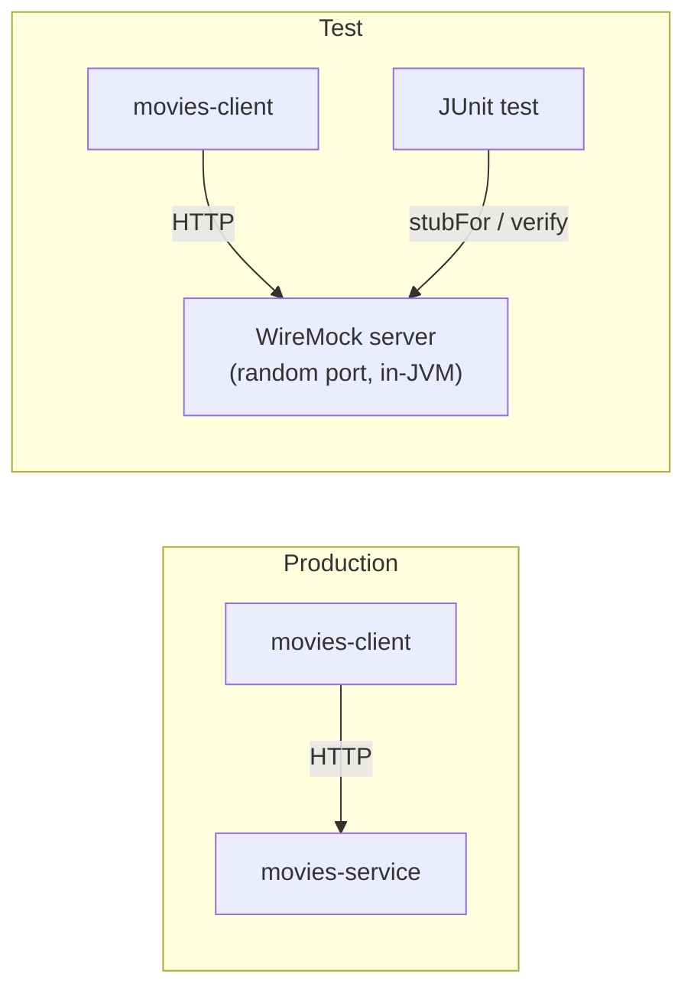
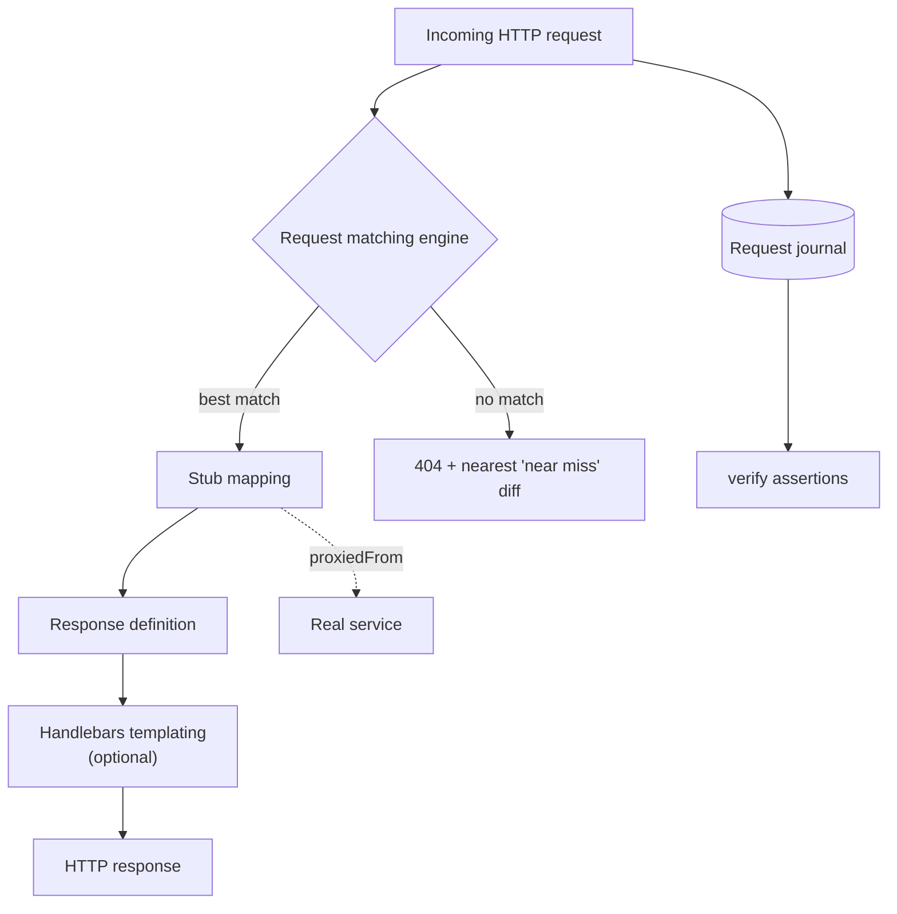
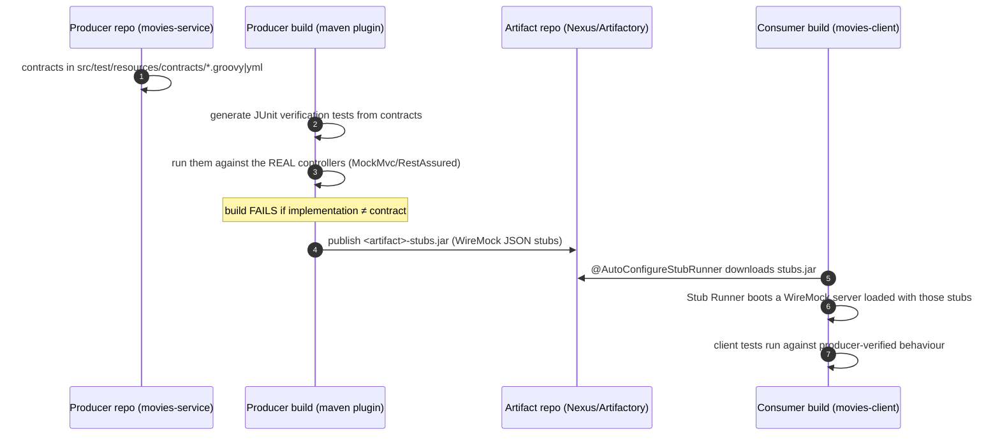

# Learning WireMock & Spring Cloud Contract


Spring Boot multi-module Maven project for learning [WireMock 3.x](https://wiremock.org/) —
HTTP service virtualisation for testing REST clients — and how it relates to
[Spring Cloud Contract](https://spring.io/projects/spring-cloud-contract/), the JVM's
consumer-driven contract testing framework that *generates* WireMock stubs from contracts.

---

## Table of contents

1. 🌐 [Why mock HTTP services at all?](#1-why-mock-http-services-at-all)
2. 🤝 [WireMock — the deep dive](#2-wiremock--the-deep-dive)
   - [Architecture](#21-architecture)
   - [Deployment modes](#22-deployment-modes)
   - [Request matching reference](#23-request-matching-reference)
   - [Record & playback](#24-record--playback)
   - [Near misses](#25-near-misses)
3. ☁️ [Spring Cloud Contract — the deep dive](#3-spring-cloud-contract--the-deep-dive)
   - [The dual-consumer problem contracts solve](#31-the-dual-consumer-problem-contracts-solve)
   - [How the flow works](#32-how-the-flow-works)
   - [Writing a contract](#33-writing-a-contract)
   - [Producer side: generated verification tests](#34-producer-side-generated-verification-tests)
   - [Consumer side: Stub Runner](#35-consumer-side-stub-runner)
   - [Messaging contracts](#36-messaging-contracts)
   - [Spring Cloud Contract in this repo](#37-spring-cloud-contract-in-this-repo)
4. ☁️ [WireMock vs Spring Cloud Contract vs Pact](#4-wiremock-vs-spring-cloud-contract-vs-pact)
5. 🏗️ [Project modules & structure](#5-project-modules--structure)
6. 🚀 [Running everything](#6-running-everything)
7. 🧪 [WireMock 3.x — features covered in the tests](#7-wiremock-3x--features-covered-in-the-tests)
8. 🤝 [WireMock 3.x best practices](#8-wiremock-3x-best-practices)
9. 🏗️ [Design patterns used](#9-design-patterns-used)
10. 📈 [Observability (Prometheus + Grafana)](#10-observability-prometheus--grafana)
11. 📚 [Further reading](#11-further-reading)

---

## 1. Why mock HTTP services at all?

Testing a REST *client* against the real downstream service is slow, flaky and often
impossible: the service may not exist yet, may cost money per call, may have no way to
produce error cases on demand, and certainly can't reproduce a half-closed TCP connection
in CI at 3 a.m.

**Service virtualisation** replaces the real dependency with an in-process HTTP server that
you fully control:



What that buys you:

- **Determinism** — the "service" always answers exactly what the stub says
- **Error-path coverage** — 404s, 500s, malformed bodies, connection resets, 10-second delays: all one line of code away
- **Speed** — no network, no docker, no shared environments; a full suite runs in seconds
- **Independence** — client and service teams develop in parallel
- **Verification** — WireMock records every request, so tests can assert *what the client actually sent* (spy semantics)

The catch: a stub is only as correct as your assumption about the real API. That gap is
exactly what **contract testing** (section 3) closes.

## 2. WireMock — the deep dive

WireMock ([source](https://github.com/wiremock/wiremock), [docs](https://wiremock.org/docs/overview/))
is an HTTP mock server: a real Jetty-based server that answers requests according to
**stub mappings** and journals every request it receives.

### 2.1 Architecture



Core concepts:

| Concept | What it is |
|---|---|
| **Stub mapping** | Rule: *request pattern → response definition*. Built via Java DSL, JSON files, or REST API |
| **Request journal** | Every received request is recorded; `verify()` asserts against it |
| **Response templating** | Handlebars expressions in response bodies resolved per request |
| **Scenarios** | Named state machines — same request returns different responses as state advances (stateful REST simulation) |
| **Faults** | Protocol-level chaos: empty response, random bytes, malformed chunks |
| **Proxying** | Pass-through to a real service, optionally per-stub, optionally recording |

Matching priority: most-specific stub wins; equal specificity → most recently added.
Explicit `.atPriority(n)` overrides (lower number = higher priority).

### 2.2 Deployment modes

| Mode | When |
|---|---|
| **JUnit 5 `WireMockExtension`** (this repo) | Unit/slice tests of an HTTP client — fastest feedback |
| **Standalone JAR** (`java -jar wiremock-standalone.jar --port 8081`) | Manual exploration, non-JVM consumers, demos |
| **Docker** (`wiremock/wiremock`) | CI environments, docker-compose stacks |
| **Testcontainers module** | Integration tests wanting container isolation |
| **Embedded `WireMockServer`** | Programmatic control outside JUnit |
| **WireMock Cloud** | Hosted mock APIs, team sharing |

### 2.3 Request matching reference

From the [request matching docs](https://wiremock.org/docs/request-matching/) — the matchers
you'll actually use:

| Target | Matchers |
|---|---|
| URL | `urlEqualTo` (path+query exact), `urlPathEqualTo` (path only), `urlPathMatching` (regex), `urlPathTemplate("/movie/{id}")` |
| Method | `get/post/put/delete/patch/any` |
| Query params | `withQueryParam("name", equalTo/matching/containing(...))` |
| Headers | `withHeader("Authorization", matching("Bearer .*"))`, `absent()` |
| Cookies / Basic auth | `withCookie`, `withBasicAuth` |
| JSON body | `equalToJson` (ignoreArrayOrder/ignoreExtraElements flags), `matchingJsonPath("$.name", equalTo(...))` |
| XML body | `equalToXml`, `matchingXPath` |
| Text/binary | `containing`, `matching`, `binaryEqualTo` |
| Logic | `and(...)`, `or(...)`, `not(...)` |
| Multipart | `withMultipartRequestBody(aMultipart()...)` |

### 2.4 Record & playback

WireMock can *write your stubs for you* ([recording docs](https://wiremock.org/docs/record-playback/)):

```bash
# 1. run WireMock as a recording proxy in front of the real service
java -jar wiremock-standalone.jar --port 8089 --proxy-all="http://localhost:8081" --record-mappings

# 2. point the client at :8089, exercise it — stubs land in ./mappings, bodies in ./__files

# 3. restart without --proxy-all: recorded responses replay with zero network access
```

Great for bootstrapping a stub suite against a legacy API; then hand-edit the captured JSON
into precise, minimal stubs.

### 2.5 Near misses

When a request matches no stub, WireMock doesn't just 404 — it computes a **distance** to
every registered stub and reports the closest ones ([verifying docs](https://wiremock.org/docs/verifying/)).
A one-character path typo shows up as a near-miss diff instead of a mystery failure.
`ConsoleNotifier(true)` prints these during test runs — turn it on when debugging, off in CI.

## 3. Spring Cloud Contract — the deep dive

### 3.1 The dual-consumer problem contracts solve

WireMock stubs live in the **consumer's** repo and encode the consumer's *belief* about the
API. Nothing stops the producer from renaming a field tomorrow: the consumer's build stays
green against its now-wrong stubs and production breaks. Classic end-to-end integration
environments catch this, but slowly and expensively.

**Contract testing** makes the belief explicit and machine-checked on *both* sides:

- a **contract** file defines request/response pairs
- the **producer's build fails** if its real controllers can't satisfy the contract (generated verification tests)
- the **consumer tests** against stubs *generated from the same contract* — so a green consumer build means compatibility with what the producer actually verified

### 3.2 How the flow works

([Spring Cloud Contract docs](https://spring.io/projects/spring-cloud-contract/),
[Baeldung intro](https://www.baeldung.com/spring-cloud-contract))



Two collaboration models:

- **Producer-driven** (default): contracts live in the producer repo; consumers consume published stubs
- **Consumer-driven (CDC)**: consumers PR their expectations into the producer's contract folder (or a central contracts repo); producer's build then guarantees every consumer's expectation

### 3.3 Writing a contract

Groovy DSL (YAML, Java and Kotlin also supported):

```groovy
// src/test/resources/contracts/movies/shouldReturnMovieById.groovy
Contract.make {
    description "return movie by id"
    request {
        method GET()
        urlPath("/movieservice/v1/movie/1")
    }
    response {
        status OK()
        headers { contentType(applicationJson()) }
        body(
            movie_id: 1,
            name: "Batman Begins",
            year: 2005
        )
        bodyMatchers {
            jsonPath('$.movie_id', byRegex(nonEmpty()))   // loose matching where values vary
        }
    }
}
```

Key DSL powers: regex matchers per field, different value shown to consumer vs producer
(`$(consumer(...), producer(...))`), request/response templating, priority, and reusable
common parts.

### 3.4 Producer side: generated verification tests

`spring-cloud-contract-maven-plugin` turns every contract into a JUnit test extending your
base class:

```xml
<plugin>
    <groupId>org.springframework.cloud</groupId>
    <artifactId>spring-cloud-contract-maven-plugin</artifactId>
    <extensions>true</extensions>
    <configuration>
        <baseClassForTests>com.learnwiremock.movies.ContractVerifierBase</baseClassForTests>
        <testFramework>JUNIT5</testFramework>
    </configuration>
</plugin>
```

```java
// what gets generated (simplified)
@Test
public void validate_shouldReturnMovieById() throws Exception {
    MockMvcRequestSpecification request = given();
    ResponseOptions response = given().spec(request).get("/movieservice/v1/movie/1");
    assertThat(response.statusCode()).isEqualTo(200);
    DocumentContext parsedJson = JsonPath.parse(response.getBody().asString());
    assertThatJson(parsedJson).field("['name']").isEqualTo("Batman Begins");
}
```

The base class boots the controller (usually `@SpringBootTest` + RestAssured-MockMvc with
mocked service layer). `mvn install` then also produces
`movies-service-<version>-stubs.jar` containing the equivalent WireMock JSON mappings —
the stubs are a *by-product of a verified build*, which is the whole point.

### 3.5 Consumer side: Stub Runner

```java
@SpringBootTest
@AutoConfigureStubRunner(
        ids = "com.learnwiremock:movies-service:+:stubs:8081",   // group:artifact:version:classifier:port
        stubsMode = StubRunnerProperties.StubsMode.LOCAL)         // LOCAL m2 / REMOTE repo / CLASSPATH
class MoviesRestClientContractTest {
    // client hits localhost:8081 — a WireMock server loaded with producer-verified stubs
}
```

`+` means "latest". `CLASSPATH` mode is handy in monorepos; `REMOTE` pulls from Nexus in CI.
There's also a standalone **Stub Runner Boot** JAR and a
[Docker image for non-JVM consumers](https://paradigma-digital.medium.com/using-the-stubs-generated-with-spring-cloud-contract-in-docker-ce4a262841be).

### 3.6 Messaging contracts

Contracts aren't HTTP-only — the same DSL describes messages (Kafka, RabbitMQ, JMS via
Spring Cloud Stream binders):

```groovy
Contract.make {
    label 'movie_created'
    input { triggeredBy('createMovie()') }
    outputMessage {
        sentTo 'movies-events'
        body(movieId: 1, name: 'Batman Begins')
    }
}
```

Producer build verifies the message really gets sent; consumer uses `StubTrigger` to fire
`movie_created` and assert its listener handles the payload.

### 3.7 Spring Cloud Contract in this repo

`movies-client` pulls WireMock through the **`spring-cloud-contract-wiremock`** artifact —
the Spring-managed WireMock integration. Even without contracts, it gives:

- BOM-managed WireMock version aligned with Spring Boot
- `@AutoConfigureWireMock(port = 0)` — WireMock lifecycle wired into the Spring test context, `${wiremock.server.port}` property injection

This repo's hand-written stub tests (section 7) use the plain `WireMockExtension` for
fine-grained control over faults/delays/templating — that's the right tool for exercising
client error-handling paths a contract can't express. Alongside them, `movies-service` now
carries real **producer contracts** and `movies-client` a **stub-runner consumer test**, so
both styles live side by side:

```
learning-wiremock/
├── movies-service/                                       # producer
│   └── src/test/
│       ├── resources/contracts/movies/                   # Groovy DSL contracts
│       │   ├── shouldReturnMovieById.groovy
│       │   ├── shouldReturn404ForUnknownMovieId.groovy
│       │   └── shouldCreateMovie.groovy
│       └── java/.../ContractVerifierBase.java             # RestAssuredMockMvc base class
└── movies-client/                                        # consumer
    └── src/test/java/.../MoviesRestClientContractIntgTest.java
                                                             # @AutoConfigureStubRunner(LOCAL)
```

Run it:

```bash
mvn install -pl movies-service          # generates + runs 3 contract tests, publishes
                                         # movies-service-<version>-stubs.jar to ~/.m2
mvn test -pl movies-client              # includes MoviesRestClientContractIntgTest,
                                         # which boots WireMock loaded with those stubs
```

Both green confirms real end-to-end agreement: the producer's controller was verified
against the exact same request/response shapes the consumer's stub-runner test replays.
(`spring-cloud-contract-maven-plugin` version is pinned to match whatever
`spring-cloud-dependencies` — via `learning-bom` — manages; check `movies-service/pom.xml`
if bumping the Spring Cloud train.)

## 4. WireMock vs Spring Cloud Contract vs Pact

| | **WireMock** | **Spring Cloud Contract** | **Pact** |
|---|---|---|---|
| What it is | HTTP mock server | Contract-testing framework (uses WireMock for stubs) | Contract-testing framework + broker |
| Who writes the expectation | Consumer test code | Contract file (producer repo, or consumer PRs it) | Consumer test code (pact file generated) |
| Producer verified? | ❌ No — stubs can drift from reality | ✅ Generated tests fail producer build | ✅ Provider verification against broker pacts |
| Stub fidelity | Whatever you write | Generated from verified contract | Generated from consumer expectations |
| Polyglot | Any client (it's just HTTP); Java/Python/Go bindings | JVM-first (Docker images for others) | First-class multi-language |
| Messaging | ❌ | ✅ Spring Cloud Stream | ✅ |
| Infrastructure | None | Artifact repo for stubs jar | Pact Broker |
| Best for | Client unit tests, error/fault simulation, exploration | Spring-to-Spring service estates | Polyglot estates, org-wide CDC |

They compose: **WireMock for how your client behaves under failure; Spring Cloud Contract for
whether producer and consumer still agree.** Fault injection (section 7.7–7.8) is something
contracts can't express — you need raw WireMock for that.

## 5. Project modules & structure

| Module | Description |
|---|---|
| `movies-client` | REST client for the movies service, with full WireMock test suite |

## Tech stack

| Layer | Technology |
|---|---|
| Language | Java 25 |
| Framework | Spring Boot 4.1.0 |
| HTTP client | Spring WebFlux `WebClient` |
| Mocking | WireMock 3.x (via `spring-cloud-contract-wiremock`) |
| Testing | JUnit 5 · TestContainers |
| Observability | Spring Actuator · Micrometer · Prometheus · Grafana |
| Build | Maven 3.9 (parent: `super-pom`) |

```
learning-wiremock/
├── pom.xml                           # aggregator (packaging=pom)
├── docker-compose.yml                # movies-service + Prometheus + Grafana
├── observability/
│   └── prometheus.yml
├── insomnia-collection.json          # import into Insomnia to test the movies service
├── image/                            # README images
├── movies-restful-service/           # pre-built JARs of the movies REST API (port 8081)
│   ├── movies-restful-service-beyond-java8.jar
│   └── movies-restful-service-java8.jar
└── movies-client/
    ├── pom.xml
    └── src/
        ├── main/java/com/learnwiremock/
        │   ├── LearnWiremockApplication.java
        │   ├── config/
        │   │   ├── MoviesClientProperties.java   # @ConfigurationProperties record
        │   │   └── WebClientConfig.java          # WebClient factory bean (Factory Method)
        │   ├── constants/MovieAppConstants.java
        │   ├── dto/Movie.java                    # Lombok @Builder
        │   ├── exception/MovieErrorResponseException.java
        │   └── service/MoviesRestClient.java     # Template Method (GoF)
        ├── main/resources/
        │   ├── application.yml
        │   ├── banner.txt
        │   └── logback-spring.xml
        └── test/
            ├── java/com/learnwiremock/service/
            │   ├── MoviesRestClientTest.java                # happy-path + error stubs
            │   ├── MoviesRestClientServerErrorTest.java     # faults + timeouts
            │   └── MoviesRestClientSelectiveProxyingTest.java # proxy overrides
            └── resources/__files/                           # WireMock response body files
```

## 6. Running everything

### Start movies-service + observability stack

```bash
docker compose up -d
```

The movies REST service starts on **port 8081** via Docker (Java 21 image, `beyond-java8` JAR).

| Service | URL |
|---|---|
| Movies API | `http://localhost:8081/movieservice/v1/allMovies` |
| Swagger UI | `http://localhost:8081/movieservice/swagger-ui.html` |
| Prometheus | `http://localhost:9090` |
| Grafana | `http://localhost:3000` (admin / admin) |

### Start the movies-client Spring Boot app

```bash
cd movies-client
mvn spring-boot:run
```

App starts on **port 8083** and connects to the movies service at `http://localhost:8081`.

| Endpoint | URL |
|---|---|
| Health | `http://localhost:8083/actuator/health` |
| Info | `http://localhost:8083/actuator/info` |
| Prometheus metrics | `http://localhost:8083/actuator/prometheus` |

### Run the tests

```bash
# all modules
mvn test

# movies-client only
mvn test -pl movies-client
```

WireMock starts on a **random port** per test class — no port conflicts, parallel-safe.

---

## 7. WireMock 3.x — features covered in the tests

### 7.1 JUnit 5 native extension (best practice)

Use `WireMockExtension` with `@RegisterExtension` — replaces the legacy JUnit 4 `@Rule WireMockRule`.

```java
@RegisterExtension
static WireMockExtension wireMock = WireMockExtension.newInstance()
        .options(wireMockConfig()
                .dynamicPort()                  // random port — no conflicts
                .notifier(new ConsoleNotifier(false))
                .templatingEnabled(true)        // WireMock 3.x built-in templating
                .globalTemplating(true))        // apply to every stub automatically
        .build();
```

> **WireMock 3.x note:** Do NOT manually register `ResponseTemplateTransformer` via `.extensions()`.
> Use `.templatingEnabled(true).globalTemplating(true)` — it is built in.

### 7.2 URL & method matching

```java
// exact path
wireMock.stubFor(get(urlPathEqualTo("/movieservice/v1/allMovies"))...);

// regex path
wireMock.stubFor(get(urlPathMatching("/movieservice/v1/movie/[0-9]+"))...);

// query parameter
wireMock.stubFor(get(urlPathEqualTo("/movieservice/v1/movieByName"))
        .withQueryParam("movie_name", equalTo("Avengers"))...);
```

### 7.3 Request body matching

```java
wireMock.stubFor(post(urlPathEqualTo("/movieservice/v1/movie"))
        .withRequestBody(matchingJsonPath("$.name", equalTo("Eternals")))
        .withRequestBody(matchingJsonPath("$.cast", containing("Salma")))...);
```

### 7.4 Response body from file (`__files/`)

Files in `src/test/resources/__files/` are served as-is.

```java
wireMock.stubFor(get(urlPathEqualTo("/movieservice/v1/allMovies"))
        .willReturn(aResponse()
                .withStatus(200)
                .withHeader(HttpHeaders.CONTENT_TYPE, MediaType.APPLICATION_JSON_VALUE)
                .withBodyFile("all-movies.json")));
```

### 7.5 Response templates (Handlebars)

With `.templatingEnabled(true).globalTemplating(true)`, any `{{...}}` in a body file is evaluated:

| Expression | What it resolves to |
|---|---|
| `{{request.path.[3]}}` | 4th path segment (e.g. the `{id}` in `/movie/9`) |
| `{{request.query.movie_name.[0]}}` | First value of query param `movie_name` |
| `{{jsonPath request.body '$.name'}}` | JSON field from the request body |
| `{{randomValue length=10 type='ALPHANUMERIC'}}` | Random alphanumeric string |

```json
// movie.json — injects path segment as movie_id
{ "movie_id": {{request.path.[3]}}, "name": "Batman Begins" }

// add-movie-byTemplate.json — echoes request body fields
{ "movie_id": {{randomValue length=5 type='NUMERIC'}},
  "name": "{{jsonPath request.body '$.name'}}" }
```

### 7.6 HTTP error simulation

```java
wireMock.stubFor(get(anyUrl()).willReturn(serverError()));          // 500
wireMock.stubFor(get(anyUrl()).willReturn(serviceUnavailable()));   // 503
wireMock.stubFor(get(anyUrl()).willReturn(aResponse()
        .withStatus(404).withBodyFile("404-movieid.json")));
```

### 7.7 Network fault simulation

```java
wireMock.stubFor(get(anyUrl())
        .willReturn(aResponse().withFault(Fault.EMPTY_RESPONSE)));          // TCP close before response
wireMock.stubFor(get(anyUrl())
        .willReturn(aResponse().withFault(Fault.RANDOM_DATA_THEN_CLOSE)));  // garbled bytes + close
```

### 7.8 Latency & timeout simulation

```java
// fixed delay
wireMock.stubFor(get(anyUrl()).willReturn(aResponse().withFixedDelay(10_000)));   // 10 s

// random delay in range
wireMock.stubFor(get(anyUrl()).willReturn(aResponse().withUniformRandomDelay(6_000, 10_000)));
```

Pair with a client-side `responseTimeout` to verify timeout handling:

```java
HttpClient httpClient = HttpClient.create()
        .option(ChannelOption.CONNECT_TIMEOUT_MILLIS, 5000)
        .responseTimeout(Duration.ofSeconds(5));
```

### 7.9 Selective proxying

Forward everything to the real service, then override specific paths with stubs:

```java
// pass-through proxy
wireMock.stubFor(any(anyUrl())
        .willReturn(aResponse().proxiedFrom("http://localhost:8081")));

// override just one endpoint
wireMock.stubFor(get(urlPathEqualTo("/movieservice/v1/movie/1"))
        .willReturn(aResponse().withBodyFile("movie.json")));
```

### 7.10 Request verification (WireMock spy)

Assert that your client actually made the expected HTTP calls:

```java
wireMock.verify(exactly(1), postRequestedFor(urlPathEqualTo("/movieservice/v1/movie"))
        .withRequestBody(matchingJsonPath("$.name", equalTo("Eternals2"))));

wireMock.verify(exactly(1),
        deleteRequestedFor(urlEqualTo("/movieservice/v1/movieByName?movieName=Eternals2")));
```

---

## 8. WireMock 3.x best practices

| Practice | Why |
|---|---|
| `@RegisterExtension static` | Shares one WireMock server per test class; resets stubs between tests |
| `.dynamicPort()` | Avoids port conflicts in parallel test execution |
| `.templatingEnabled(true).globalTemplating(true)` | WireMock 3.x built-in — no manual `ResponseTemplateTransformer` needed |
| Instance `wireMock.stubFor()` not static `stubFor()` | Scoped to the extension; static method uses a global client and causes confusion in multi-server setups |
| Body files in `__files/` | Separates test data from test code; reusable across stubs |
| `withBodyFile()` over inline `.withBody()` | Cleaner for large JSON; supports Handlebars templating from the file |
| `wireMock.verify()` after the act | Adds spy-level assurance that the client actually called the stub |
| Use `matchingJsonPath` for partial request matching | More resilient than full JSON equality; tolerates field ordering |
| `ConsoleNotifier(true)` while debugging | Prints near-miss diffs when a request doesn't match any stub |
| Prefer contracts over long-lived hand stubs | Hand-written stubs drift; producer-verified stubs (section 3) can't |

---

## 9. Design patterns used

| Pattern | Where |
|---|---|
| **Template Method** (GoF) | `MoviesRestClient.executeRequest()` — invariant error handling, variant HTTP calls |
| **Builder** (GoF) | `Movie` via Lombok `@Builder` |
| **Factory Method** (GoF) | `WebClientConfig.moviesWebClient()` — constructs the `WebClient` bean |
| **Singleton** (GoF) | All `@Service` / `@Configuration` Spring beans |

---

## 10. Observability (Prometheus + Grafana)

In Grafana:
1. Add datasource → Prometheus → `http://prometheus:9090`
2. Import dashboard **4701** (JVM Micrometer)

Prometheus scrapes `host.docker.internal:8083/actuator/prometheus` every 10 s.

---

## 11. Further reading

- [WireMock docs](https://wiremock.org/docs/overview/) · [stubbing](https://wiremock.org/docs/stubbing/) · [request matching](https://wiremock.org/docs/request-matching/) · [verifying](https://wiremock.org/docs/verifying/) · [GitHub](https://github.com/wiremock/wiremock)
- [Spring Cloud Contract project](https://spring.io/projects/spring-cloud-contract/) · [Baeldung intro](https://www.baeldung.com/spring-cloud-contract) · [Okta: better integration testing with SCC](https://developer.okta.com/blog/2022/02/01/spring-cloud-contract)
- [SCC stubs in Docker for non-JVM consumers](https://paradigma-digital.medium.com/using-the-stubs-generated-with-spring-cloud-contract-in-docker-ce4a262841be)
- [Consumer-driven contract testing with SCC — DZone](https://dzone.com/articles/consumer-driven-contract-testing-with-spring-cloud)
- [WireMock advanced usage patterns](https://medium.com/javarevisited/wiremock-advanced-usage-patterns-c394ad2e3b78)
